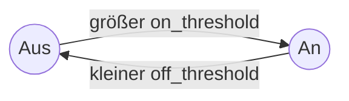
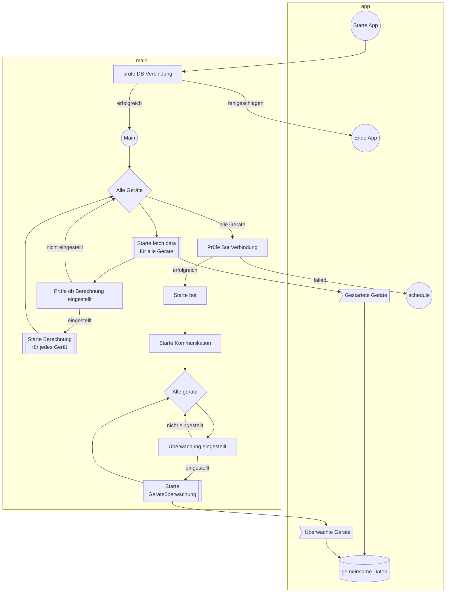

# IntelligentSocketDatalogger
[](https://github.com/Technik-Tueftler/IntelligentSocketDatalogger/actions/workflows/build.yml)[](https://github.com/Technik-Tueftler/IntelligentSocketDatalogger/actions/workflows/merge_test.yml)

IntelligentSocketDatalogger ist eine App, welche in einzel einstellbaren Zeitintervallen intelligente Steckdosen abfragt und deren Rückgabewerten in eine InfluxDB speichert. Dabei kann jede Steckdose mit zusätzlichen Parametern eingestellt werden. So kann man sich einmal am Tag (Uhrzeit variable) die gesamten Wh pro Gerät in eine Textdatei schreiben lassen.

[English readme](https://github.com/Technik-Tueftler/IntelligentSocketDatalogger/blob/main/README.md)
 • [deutsche readme](https://github.com/Technik-Tueftler/IntelligentSocketDatalogger/blob/main/README.de.md)

## Übersicht
- Unterstützt wird Python 3.10
- Läuft lokal, als auch als Docker Container
- Getestet wurden `Shelly Plug S` und  `Shelly 3EM` Steckdosen

## Unterstütze Steckdosen
Über das Plugin-Konzept kann man jede eigene Steckdose einbinden, indem man einen eigenen Handler schreibt und die Daten angibt, die zurückgegeben werden sollen. Im Kapitel `Eigene Steckdosen benutzen` werden die einzelnen Schritte zur Umsetzung erklärt. Außerdem gibt es einige Beispiele in der Datei device_plugin.py.
- Shelly Plug S (Typbezeichnung: shelly:plug-s)  
- Shelly 3EM (Typbezeichnung: shelly:3em)  

## Auflistung Zusatzfunktionen
`Kostenzusammenfassung:` Gibt die Gesamtarbeit in KWh für den geforderten Zeitraum aus und berechnet die Gesamtkosten.  
`Einschaltzähler:` Zählt wie häufig sich ein Gerät, für den geforderten Zeitraum, einschaltet.  
`Telegram-Bot: ` Alle Funktionen können über einen Chat in Telegram angezeigt und gesteuert werden.
`Elek. Arbeit Warnung:` Kontrolliert, wenn ein Gerät mehr elekt. Arbeit hat als vorher eingestellt. Als Beispiel, wenn der Kühlschrank offen ist.
`Energieanzeige:` Anzeige der elekt. Arbeit der Geräte aus den letzten Perioden
`Geräte schalten:` Ein- und Ausschalten von Geräten, wenn die Steckdose das zulässt.

## Installation und Ausführung
1. Lokal läuft das Programm durch Ausführen der `main.py`. Aktuell muss noch darauf geachtet werden, dass die Umgebungsvariablen in die IDE oder in die Umgebung geladen werden. Hierzu einfach das Repository kopieren und die main.py starten. Getestet und entwickelt wurde das Programm unter Python 3.10.
2. Über einen Docker Container. Siehe Dokumentation: <https://hub.docker.com/r/techniktueftler/intelligent_socket_datalogger>

## Umgebungsvariablen
| Variable                  | Erklärung                              | Einheit | Standardwert | Nötig |
|:--------------------------|:---------------------------------------|:-------:|:------------:|:-----:|
| DB_IP_ADDRESS             | IP Adresse oder Hostname der Datenbank |    -    |      -       |  Ja   |
| DB_USER_NAME              | Benutzername zum einloggen in die DB   |    -    |      -       |  Ja   |
| DB_NAME                   | Datenbankname zum speichern der Daten  |    -    |      -       |  Ja   |
| DB_USER_PASSWORD          | Passwort zum Benutzername              |    -    |    Keins     | Nein  |
| DB_PORT                   | Port zur Datenbank                     |    -    |     8086     | Nein  |
| SSL                       | Wird SSL benutzt                       |    -    |    False     | Nein  |
| VERIFY_SSL                | SSL verifizierte                       |    -    |    False     | Nein  |

## Database structure
| Name                 |   Typ   | Erklärung                                                            |  Einheit   |
|:---------------------|:-------:|:---------------------------------------------------------------------|:----------:|
| device               | String  | Name des Gerätes                                                     |     -      |
| time                 | String  | Zeitstempel der Messung in UTC                                       |     -      |
| power                |  Float  | Aktuelle Leistung des Gerätes. Formatierung: %Y-%m-%dT%H:%M:%S.%fZ"  |    Watt    |
| is_valid             | Boolean | Zurückgegebene Werte sind ok                                         |     -      |
| device_temperature   |  Float  | Temperatur der Steckdose (keine Umgebungstemperatur                  |     °C     |
| fetch_success        | Boolean | Gerät war während der Abfrage erreichbar                             |     -      |
| energy_wh            |  Float  | Aktuelle Arbeit des Gerätes in der letzten Zeitperiode               | Wattstunde |
| current_a _b _c      |  Float  | Aktueller Strom der auf dem Modul A, B or C fliesßt im Shelly 3EM    |   Ampere   |
| energy_wh_a _b _c    |  Float  | Aktuelle Arbeit im Modul A, B or C umgesetzt wird im Shelly 3EM      | watt-hour  |
| is_valid_a _b _c     | Boolean | Zurückgegebene Werte sind ok für die Module A, B or C vom Shelly 3EM |     -      |
| power_a _b _c        |  Float  | Aktuelle Leistung im Modul A, B or C des Shelly 3EM                  |    Watt    |
| power_factor_a _b _c |  Float  | Aktueller Leistungsfaktor im Modul A, B or C des Shelly 3EM          |    Watt    |
| voltage_a _b _c      |  Float  | Aktuelle Spannung die auf dem Modul A, B or C anliegt im Shelly 3EM  |    Volt    |


## Konfigurationsdateien
Um das Projekt an die eigenen Vorstellungen anzupassen, stehen zwei Konfigurationsdateien zur Verfügung. Des Weiteren gibt es automatisch erzeuge Dateien, welche von einem Fehler abhängen oder der Einstellung des Projektes.

| Name             | Erklärung                                 |    Pfad     |
|:-----------------|:------------------------------------------|:-----------:|
| config.json      | Allgemeine Einstellungen für das Projekt  |  ../files/  |
| devices.json     | Auflistung aller Intelligenten Steckdosen |  ../files/  |
| main.log         | Fehler- und Informationsprotokollierung   |  ../files/  |
| <Gerätename>.log | Informationsprotokollierung               |  ../files/  |

### config.json
````commandline 
{
  "general":
  {
    "log_level": "info",
    "calc_request_time_daily": "00:00",
    "calc_request_time_monthly": "01",
    "calc_request_time_yearly": "01.01",
    "price_kwh": 0.296
  },
  "telegrambot":
  {
    "chat_id_source": "auto",
    "update_time": 10,
    "inline_keys_columns": 3
  }
}
````
`log_level:` Protokollierungslevel für das Projekt. Mögliche Einstellungen: *debug, info, warning, error, critical*  
`calc_request_time_daily:` Gib die Uhrzeit an, zu dem die eingestellten Auswertungen täglich gestartet werden. Dieser Parameter gilt für alle Auswertungen. Die Standarduhrzeit ist 00:00 Uhr.  
`calc_request_time_monthly:` Gibt den Tag im Monat an, an dem die eingestellten Auswertungen monatlich gestartet werden sollen. Die Standardeinstellung ist der erste eines Monats.  
`calc_request_time_yearly:` Gibt den Tag und Monat im Jahr an, an dem die eingestellten Auswertungen jährlich gestartet werden soll. Die Standardeinstellung ist der 01.01.  
`price_kwh:` Gibt den Preis pro Kilowattstunde an. Der Standardwert ist 0.30€.  
`chat_id_source:` Wie die Chat-ID abgelegt wird. Es gibt *auto* und *manuel* als Einstellung. Weitere Informationen weiter unten. 
`update_time:` Update-Zeit bei der Bot auf neue Nachrichten prüft.
`inline_keys_columns:` Gibt an wie viele Gerätenamen in einer Zeile im Chat angezeigt werden.

### devices.json
````commandline 
{
  "Waschmaschine":
  {
    "type": "shelly:plug-s",
    "ip": "192.168.178.200",
    "update_time": 10,
    "cost_calculation":
    {
      "daily": true,
      "monthly": true,
      "yearly": true
    },
    "power_on_counter":
    {
      "daily": false,
      "monthly": true,
      "yearly": false,
      "on_threshold": 2,
      "off_threshold": 1
    }
  }
}
````
`Waschmaschine:` Gerätename, welcher aufgezeichnet wird.  
`type:` Typ der Steckdose. Aktuell werden standardmäßig __shelly:plug-s__ und __shelly:3em__ unterstützt.  
`ip:` IP-Adresse im verbundenen Netzwerk  
`update_time:` Aktualisierungszeit in welchem Abstand neue Daten abgefragt werden sollen. Angabe ist in __Sekunden__.  

#### Kostenzusammenfassung (cost_calculation)
Mit dieser Funktion kann man festlegen, ob man eine tägliche, monatliche und jährliche Zusammenfassung haben möchte. Die Optionen `daily`, `monthly` und `yearly` werden jeweils mit `true` für aktiv oder `false` für inaktiv belegt.  

#### Einschaltzähler (power_on_counter)
Mit dieser Funktion wird gezählt, wie häufig sich ein Gerät am Tag, im Monat und im Jahr einschaltet. Die Optionen `daily`, `monthly` und `yearly` werden jeweils mit `true` für aktiv oder `false` für inaktiv belegt.  
`on_threshold:` Der Wert in Watt, welcher überschritten werden muss, damit ein **Einschalten** erfasst wird.  
`off_threshold:` Der Wert in Watt, welcher unterschritten werden muss, damit ein **Ausschalten** erfasst wird.  


### ISDL Config Editor
Für ein einfaches erstellen der Konfigurationsdateien auf den eigenen Aufbau, gibt es unter [ISDL Config Editor](https://isdledit.jojojux.de/editor) eine grafische Benutzeroberfläche. Hier kann über ein Eingebefenster z.B. der Preis/kWh eingestellt und am Ende die fertig formatierte Konfigurationsdatei heruntergeladen werden. Auch können alle Steckdosen einzel hinzugefügt werden mit den nötigen Einstellungen. Das erleichtert das Einstellen und verhindert Formatierungsfehler.

## Docker Compose Beispiel
````commandline
version: "2"
services:
  influxdb:
    image: techniktueftler/intelligent_socket_datalogger
    container_name: intelligent_socket_datalogger
    volumes:
      - /srv/dev-disk-by-uuid-0815/data/socket_datalogger/:/user/app/IntelligentSocketDatalogger/files/
    environment:
      - DB_IP_ADDRESS=192.193.194.195
      - DB_USER_NAME=shellyplug
      - DB_NAME=power_consumption
````

## Eigene Steckdosen benutzen
Es ist möglich, eine eigene Implementierung zu erstellen um eine beliebige intelligente Steckdose einzubinden. Dazu muss das Gerät über eine Möglichkeit verfügen, Daten abzurufen. Entweder über eine http-Anfrage oder über eine API, welche über Python erreicht werden kann. Die Schritte wären:  
1. Kopieren Sie die Plugin-Vorlage (Projektverzeichnis in files mit dem Namen device_plugin.py) in den gemounteten Pfad des Docker-Containers.  
2. Schreiben Sie für jedes Gerät einen eigenen Handler und weisen Sie über den Dekorator einen Typ zu. Hier können Sie Ihren eigenen Namen angeben. Dieser Typ ist dann das, was Sie in der device.conf für das Gerät als Typ angeben.  
3. Der Code unter `def handler` muss dann die Anfrage ans Geräte, die Verarbeitung und am Ende die Rückgabe der Daten im gewünschten Format enthalten.  
Hier einfach dem Beispiel folgen, welches in der Template Datai enthalten ist. Wenn etwas unklar oder schlecht definiert ist, bitte unbedingt mir schreiben.  

# App Funktionsablauf
